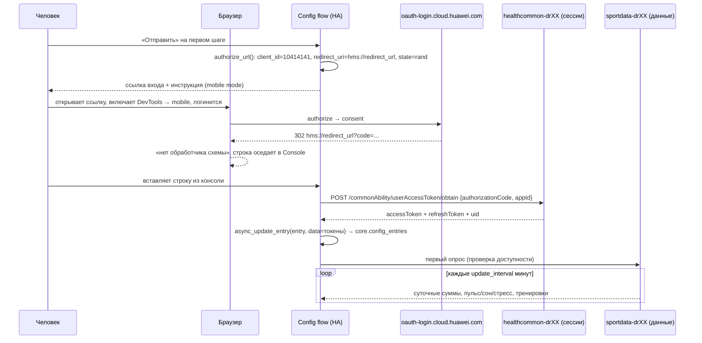

# Huawei Health для Home Assistant

Интеграция, которая читает данные из **собственного облака приложения Huawei Health**
(`com.huawei.health`) и создаёт сенсоры шагов, сна, пульса, стресса и тренировок.
Телефон, часы и приложение Home Assistant для этого не нужны: нужен только браузер, в
котором один раз за 180 дней выполняется вход в HUAWEI ID.

Поддерживает **несколько аккаунтов одновременно** — каждый как отдельная запись
интеграции, со своими токенами, своим интервалом опроса и своим набором сенсоров.

> **English summary.** This is a custom Home Assistant integration for the Huawei Health
> app's own cloud (`sportdata-drXX.things.dbankcloud.*`), not for the Health Kit API. It
> needs no phone, no watch and no Huawei emulator. Login is browser-assisted (Huawei's
> captcha is meant for a human), the token pair is then rotated by the integration itself
> for 180 days. Multiple accounts = multiple config entries. Install through HACS, then
> follow *Подключение* below — the consent button only responds to touch, so the browser
> has to be switched to mobile device mode in DevTools.

---

## Содержание

- [Зачем ещё одна интеграция](#зачем-ещё-одна-интеграция)
- [Что отдаёт в сенсоры](#что-отдаёт-в-сенсоры)
- [Требования](#требования)
- [Установка](#установка)
- [Подключение](#подключение)
- [Схема работы интеграции](#схема-работы-интеграции)
- [Настройки аккаунта](#настройки-аккаунта)
- [Несколько аккаунтов](#несколько-аккаунтов)
- [Примеры автоматизаций](#примеры-автоматизаций)
- [Что делать при ошибках](#что-делать-при-ошибках)
- [Безопасность и ограничения](#безопасность-и-ограничения)
- [Разработка и релизы](#разработка-и-релизы)

---

## Зачем ещё одна интеграция

Официальный путь («Health Kit / REST API для партнёров») требует регистрации приложения в
AGC, прохождения верификации Huawei и ожидания согласия пользователя на каждый scope; данные
отдаются в другом формате и не для всех типов. Существующие интеграции (`huawei_health`
из `custom_components`-репозиториев) обычно читают **экспорт** из приложения или возят
вокруг него локальный агент.

Здесь используется то же облако, в которое само приложение `com.huawei.health` выгружает
синхронизированные с часов данные: контроллер `/dataQuery/*`. Протокол восстановлен из
APK версии 16.1.6.320 (dex-код `defpackage/*`, `HealthDataCloudFactory`,
`ThirdPartyHttpUtils`, таблица маршрутизации GRS в
`assets/grs_app_global_route_config.json`) и проверен живыми запросами.

Сенсоры показывают **те же числа, что приложение**, вплоть до суточных шагов: интеграция
берёт ровно те же ответы, что и экран «Активность».

## Что отдаёт в сенсоры

Суточные значения относятся к «сегодня» (для сна — к ночи, которая только что
закончилась; облако помечает её днём пробуждения). Каждый сенсор несёт атрибут `date` —
дату, за которую пришло значение.

| Сенсор | Единица | Откуда |
| --- | --- | --- |
| Шаги за день | шаги | `getSportsStat` → `sportBasicInfo.steps` |
| Дистанция за день | км | `getSportsStat` → `distance` (метры на проводе) |
| Калории за день | ккал | `getSportsStat` → `calorie` (0.001 ккал на проводе) |
| Активность за день | мин | `getSportsStat` → `duration` |
| Ходьба за день | мин | `dimenDailyActivity.walkDurations` |
| Активные часы за день | ч | `activeHourBasic.countActiveHour` |
| Интенсивные минуты за день | мин | `exerciseTimeBasic.totalMidHighIntensity` |
| Цель по шагам | шаги | `goalAchieveBasic.stepGoalValueStat` (выключен по умолчанию) |
| Пульс покоя, Пульс, Max, Min | уд/мин | `getHealthStat` type 7 → `heartRateBasic` |
| Сон, Глубокий, REM, Поверхностный, Бодрствование | мин | `getHealthStat` type 9 → `professionalSleep` |
| Оценка сна, Эффективность, ВСР, SpO2 | баллы / % / мс | там же: `sleepScore`, `sleepEfficiency`, `lastAvgHrv`, `lastAvgSpO2` |
| Стресс, Стресс (последний) | баллы | `getHealthStat` type 11 → `stressBasic` |
| Последняя тренировка | enum (бег/велосипед/…) | `getSportsDataByTime`, сегменты склеены в сессию |
| Длительность / дистанция / калории последней тренировки | мин, км, ккал | там же |
| Тренировок за период | шт | число сессий в окне |
| Повторный вход через, дней | дни | остаток жизни refresh-токена |

Типы с нулевым значением (`lastAvgSpO2 = -1`, `avgRestingHeartRate = 0` и т. п.) — это не
измерение, а «часы не мерили»: сенсор уходит в `unavailable`, а не показывает ноль.

## Требования

- Home Assistant **2024.12** или новее.
- Аккаунт HUAWEI ID, в котором есть синхронизированные данные (то есть приложение Huawei
  Health хотя бы раз сливало часы в облако).
- Компьютер с браузером (Chrome/Chromium или Firefox) для входа.
- Интеграция не ставит зависимостей из pip: только стандартная библиотека Python.

## Установка

### HACS

1. Открой **HACS → Integrations → ⋮ (три точки) → Custom repositories**.
2. Type: `Integration`, Repository: `and7ey/huawei_health`, жми **Add**.
3. В списке найди **Huawei Health** → **Download** → перезапусти Home Assistant
   (**Инструменты developer → YAML → Перезапустить службу** — не «перезагрузка конфигурации»,
   а именно перезапуск).

### Вручную

Скачай `huawei_health.zip` из [последнего релиза](../../releases), распакуй так, чтобы в
конфигурационной папке Home Assistant появился путь
`custom_components/huawei_health/manifest.json`, и перезапусти Home Assistant.

## Подключение

Вход в HUAWEI ID — единственное место, где нужен человек: страница согласия закрыта
Huawei-капчей, обходить которую интеграция не пытается. Всё остальное (обмен кода на
токены, хранение, ротация, опрос) автоматизировано.

### Шаг 1. Создай запись интеграции

**Настройки → Устройства и службы → Интеграции → Добавить интеграцию → Huawei Health**.

Первый экран показывает готовую ссылку входа — она генерируется под конкретный поток
настройки (со своим `state` и `scope`), так что копировать её из README не нужно:

```text
https://oauth-login.cloud.huawei.com/oauth2/v3/authorize?client_id=10414141
  &response_type=code&access_type=offline&display=touch&scope=...
  &redirect_uri=hms%3A%2F%2Fredirect_url&state=<8 случайных символов>&lang=en&prompt=consent
```

Нажми **Отправить** — интеграция перейдёт на экран, где нужно вставить код.

### Шаг 2. Открой ссылку в браузере и включи мобильный режим

Это критично: **кнопка «Разрешить»/«Allow» на странице согласия работает только на
касание (touch)**. Обычный клик мышью по ней не даёт ровно ничего — страница не
перезагружается, ошибок не показывает. Поэтому браузер надо перевести в режим
мобильного устройства.

Пошагово для **Chrome** (то же самое в Яндекс.Браузере, Edge, Opera — они на Chromium):

1. Открой ссылку входа в новой вкладке и залогинься в HUAWEI ID (телефон или e-mail +
   пароль). Если Huawei просит подтверждение на устройстве — подтверди.
2. Нажми **F12**. От.panel разработчика (DevTools) — обычно справа или снизу.
   Эквивалентные способы: меню **⋮ → More tools → Developer tools**, либо
   **Ctrl+Shift+I** (на macOS **Cmd+Option+I**).
3. В DevTools нажми **Ctrl+Shift+M** (macOS: **Cmd+Shift+M**). Это кнопка
   **Toggle device toolbar** — она самая левая в верхней панели DevTools, выглядит как
   прямоугольник со смартфоном (`📱`). После нажатия над страницей появляется ещё одна
   полоса, а сама страница рамками показывает, что она внутри «устройства».
4. В этой полосе слева сверху — выпадающий список **Dimensions: Not responsive**.
   Выбери в нём конкретное устройство, например **iPhone 12 Pro** или **Pixel 7**
   (пункт **Responsive** тоже работает, но с реальным профилем устройства меньше шансов
   получить десктопную вёрстку).
5. Нажми **Reload** — круговая стрелка в той же полосе DevTools (или **F5**). Страница
   должна перезагрузиться *после* включения мобильного режима: только тогда Huawei отдаст
   мобильную версию, где кнопка согласия — touch-элемент.
   Если страница изменила внешний вид (стала узкой, кнопка стала крупной плашкой) — всё
   правильно.
6. Прокрути страницу вниз до кнопки **«Разрешить» / «Allow»** и нажми её. Курсор в
   мобильном режиме выглядит как кружок и работает как палец — одного нажатия достаточно.

В **Firefox** вместо DevTools-полосы: **F12 → значок телефона/планшета (Ctrl+Shift+M)** —
дальше всё так же.

Если после нажатия «Разрешить» ничего не происходит — значит мобильный режим не
применился к уже загруженной странице: повтори пункт 5 (Reload) и нажми ещё раз.

### Шаг 3. Забери код из консоли браузера

После разрешения браузер пытается открыть `hms://redirect_url?code=...`. Это адрес
приложения Huawei Health на телефоне; на компьютере такой схемы никто не зарегистрировал,
поэтому переход не происходит, а Chrome пишет об этом в консоль. **Нужна именно эта
строка** — в ней и есть код:

```text
Failed to launch 'hms://redirect_url?code=EQFEAQNaOARz0K1p%2BmR7sT4uVwXyZ0abcDEFghIJ%2FklMNopqrSTuvwXYZ0123456789%3D%3D&state=9f2c1ab7' because the scheme does not have a registered handler.
```

Как её найти и скопировать:

1. **F12 → вкладка Console**. Строка обычно уже там (жёлтая или красная).
   В фильтре слева можно набрать `Failed to launch`, чтобы не искать глазами.
2. Кликни по строке правой кнопкой → **Copy text** (или выдели её целиком и **Ctrl+C**).
   Скопировать можно и адрес из адресной строки браузера — он тот же самый.
3. В **Firefox** вместо консоли проще смотреть **F12 → вкладка Network → первый запрос с
   кодом 302 → заголовок ответа `Location`**: там та же ссылка `hms://redirect_url?code=...`.
4. Вставь скопированное в поле интеграции и нажми **Отправить**. Лишний текст
   (`Failed to launch '`, `because the scheme...`, кавычки) интеграция отбрасывает сама —
   код вырезается из query-строки и обязательно раскодируется, потому что он
   percent-encoded и примерно 360 символов длиной (`%2B`, `%2F`, `%3D%3D` внутри
   оставлять как есть, вручную ничего «чинить» не надо).

**Код одноразовый и живёт несколько минут.** Если интеграция пишет, что Huawei его
отклонил, значит истёк срок, либо он уже был использован: открой страницу входа заново по
новой ссылке (интеграция сгенерирует её заново на шаге «Повторить вход») и повтори
процедуру.

### Шаг 4. Проверь результат

Интеграция обменяет код на пару токенов, определит аккаунт по `uid` и создаст запись с
названием по нику HUAWEI ID. Через 10–30 секунд появятся сенсоры. Название записи
(ник аккаунта) становится «устройство», а `entity_id` собираются из него и ключа сенсора:
для аккаунта `andrey` это `sensor.andrey_steps`, `sensor.andrey_sleep_duration`,
`sensor.andrey_last_activity` и так далее — точные id видны на странице устройства
(**Настройки → Интеграции → Huawei Health → запись**).

Если что-то из сенсоров `unavailable`, а не `unknown` — значит конкретный тип данных в
этом аккаунте не заполнен (например, нет устройства, измеряющего SpO2).

## Схема работы интеграции

### Общий поток



### Модули

| Файл | Ответственность |
| --- | --- |
| `const.py` | адреса контроллеров, пути эндпоинтов, id типов спорта/метрик, коды ошибок, константы HA |
| `client.py` | протокол: HTTP на stdlib-`urllib`, заголовки, тело запроса, ротация, парсинг ответов. Ни одного импорта Home Assistant |
| `config_flow.py` | ссылка входа, приём вставленного кода, обмен на токены, уникальность аккаунта, повторный вход, настройки |
| `coordinator.py` | `DataUpdateCoordinator`: опрос трёх семейств данных в воркер-потоке, частичные ошибки, снимок для сенсоров |
| `__init__.py` | сборка клиента, проверка записи, персист rotated-токенов, перезагрузка при смене настроек |
| `entity.py` | общий предок: одно сервисное «устройство» на аккаунт |
| `sensor.py` | описания сенсоров и извлечение из снимка |

### Аутентификация: как именно ходят запросы

Токен в этом облаке — **не только заголовок**. Приложение (`Suggestion_CloudFactory` /
`gkp.java`) кладёт его и в JSON-тело, и в заголовки, и облако требует именно такой
конверт:

```json
{
  "token": "<accessToken>", "tokenType": 2, "appId": "com.huawei.health",
  "ts": 1770000000000, "source": 1, "siteId": 0,
  "startTime": 20260929, "endTime": 20260929, "dataSource": 2
}
```

```http
Authorization: Bearer <accessToken>
x-token: <accessToken>
x-token-type: 2
x-huid: <uid>
x-version: and_health_16.1.6.320
Content-Type: application/json;charset=UTF-8
```

Пара живёт на одном контроллере (`healthcommon-drXX`), данные — на другом
(`sportdata-drXX`), и это разные хосты GRS (`domainHealthCloudCommon` против
`healthCloudUrl`).

### Жизненный цикл токенов

- `authorizationCode` (из браузера) → `POST /commonAbility/userAccessToken/obtain` →
  `accessToken` + `refreshToken` + `uid`. `siteId` в ответе может не быть — на чтение это
  не влияет.
- `accessToken` живёт десятки минут. Перед каждым опросом интеграция сравнивает
  `expires_at` с текущим временем и, если до истекания меньше 2 минут, ротирует сама:
  `POST /commonAbility/userAccessToken/refresh` с **числовым** `appId=10414141` (не
  именем пакета).
- Ротация **убивает предыдущий accessToken** и отдаёт тот же `refreshToken` — поэтому
  новый `accessToken` немедленно записывается в `entry.data`
  (`hass.config_entries.async_update_entry`), иначе перезагрузка HA начнёт мёртвым токеном.
- Ответ `resultCode` 1002/1004 («токен не принят») означает, что пару провернула сама
  Health-приложение на телефоне: интеграция ротирует токен и повторяет запрос один раз.
- `refreshToken` живёт 180 дней (`REFRESH_TOKEN_INTERVAL = 15552000000` мс). После этого
  остаётся только вход в браузере: интеграция ловит `20020003`, бросает
  `ConfigEntryAuthFailed`, и HA показывает карточку **Настроить** — это тот же поток
  входа, только без создания новой записи.
- Сенсор **«Повторный вход через, дней»** показывает остаток refresh-токена, так что
  приближение даты можно поймать автоматизацией.

### Что читается при опросе

| Шаг | Эндпоинт | Формат времени |
| --- | --- | --- |
| Суточные суммы | `/dataQuery/sport/v2/getSportsStat` | `startTime`/`endTime` — числа `YYYYMMDD` |
| Пульс, сон, стресс, интенсивность | `/dataQuery/health/getHealthStat` (`types: [7,9,11,12]`) | `YYYYMMDD` |
| Тренировки | `/dataQuery/sport/getSportsDataByTime` (`queryType: 1`, `dataType: 2`) | `YYYYMMDD`, окно **не больше 10 дней** |

Три ловушки, на которые я потратил больше всего времени и которые зашиты в код:

1. `*ByTime` отвечает `1001` на окно шире 10 календарных дней — поэтому 30 дней
   разбираются на окна `day_windows()`, а записи из окон дедуплицируются по `dataId`.
2. Секундные метки времени облако не принимает (только `YYYYMMDD` для `queryType: 1` и
   миллисекунды для `queryType: 2`).
3. `calorie` приходит в 0.001 ккал, `distance` — в метрах, `duration` — в минутах;
   `recordDay` — это `YYYYMMDD`.

### Как собираются тренировки

`getSportsDataByTime` отдаёт **не тренировки, а поминутные сегменты**, и каждый сегмент
присылает каждое устройство, которое его видело (часы и телефон — два комплекта одной
поездки). Поэтому (`client.sport_sessions`):

1. сегменты группируются по `sportType`;
2. внутри типа на каждую минуту остаётся один записи — тот, где больше работы
   (дистанция, шаги, калории);
3. соседние минуты склеиваются в сессию, если разрыв не больше 15 минут;
4. сессия отдаёт длительность, дистанцию, калории, число сегментов и `deviceCode`.

Именно поэтому «Последняя тренировка» совпадает с приложением, а сумма сырых сегментов —
нет.

### Опрос, ошибки, стоимость

- Опрос идёт в `async_add_executor_job`: клиент синхронный и не тянет `aiohttp`.
- Три семейства данных опрашиваются независимо. Если одно падает (аккаунт без часов
  вообще, у облака просадка), остальные всё равно обновляются; если не удалось ничего —
  `UpdateFailed`, и HA помечает данные как устаревшие, не трогая состояние сенсоров.
- `HuaweiAuthError` (1002/1004/1005/20010004/20020001/20020003) никогда не
  «пережёвывается»: он уходит в `ConfigEntryAuthFailed`, и HA рисует карточку повторного
  входа.
- Полный цикл при значениях по умолчанию: **три POST-запроса на аккаунт каждые 15 минут**.
  С 30-ю днями истории количество запросов не растёт — растёт только ответ.

### Где что хранится

| Данные | Место |
| --- | --- |
| `accessToken`, `refreshToken`, `uid`, `siteId`, сроки, хосты | `entry.data` → `.storage/core.config_entries` |
| Настройки опроса | тот же файл, но без секретов |
| Снимок данных | только в памяти координатора |
| Логи | `HuaweiAuthError`/`HuaweiApiError` содержат код и `resultDesc`, токенов в них нет |

Токены никогда не печатаются в логах, README, примерах и тестах и не попадают в git.

## Настройки аккаунта

**Настройки → Интеграции → Huawei Health → ⋮ → Настройки**:

| Поле | По умолчанию | Смысл |
| --- | --- | --- |
| Интервал опроса | 15 мин | чаще нет смысла: облако обновляется синхронизацией часов |
| Дней суточных данных | 3 | окно `*Stat`; на число запросов не влияет |
| Дней тренировок | 7 | `*ByTime` читается окнами по 10 дней |
| Опрашивать тренировки | включено | отключение убирает самый медленный запрос |
| Опрашивать пульс/сон/стресс | включено | отключай, если устройства с пульсом нет |
| `deviceCode` | 0 (весь аккаунт) | конкретные часы: id лежит в атрибуте `device_code` сенсоров последней тренировки, полный список отдаёт `POST /profile/device/getBindDevice` с пустым телом |

Изменение настроек перезагружает только эту запись интеграции.

## Несколько аккаунтов

Каждый аккаунт — самостоятельная запись: свой вход, своя пара токенов, свой интервал, свой
набор сенсоров и своё «устройство» в реестре устройств. Ограничений нет; единственное —
**нельзя добавить один и тот же HUAWEI ID дважды** (unique id — `uid`, вторая попытка
даёт `already_configured` и просто обновляет токены существующей записи).

Полезно для семьи: часы ребёнка/партнёра, синхронизированные в свой аккаунт, дают отдельные
сущности, и автоматизации на них не пересекаются.

## Примеры автоматизаций

```yaml
# Напомнить, что через две недели нужен повторный вход
automation:
  - trigger:
      - platform: numeric_state
        entity_id: sensor.andrey_relogin_in
        below: 14
    action:
      - service: notify.mobile_app
        data:
          message: >-
            Через {{ states('sensor.andrey_relogin_in') }} дней Huawei
            попросит войти заново.
```

```yaml
# Утренняя карточка: шаги за вчера не набраны, сон короткий
template:
  - sensor:
      - name: "Huawei: утренняя сводка"
        state: >-
          Шаги {{ states('sensor.andrey_steps') }};
          сон {{ (states('sensor.andrey_sleep_duration') | float(0) / 60) | round(1) }} ч;
          пульс покоя {{ states('sensor.andrey_resting_heart_rate') }}.
```

## Что делать при ошибках

| Симптом | Причина | Что делать |
| --- | --- | --- |
| `already_configured` при входе | аккаунт уже добавлен | обнови токены через «Настроить» (reauth), а не создавай новую запись |
| `20020001` | `authorizationCode` истёк или уже использован | открой страницу входа заново и вставь новый код |
| `20020003` | refresh-токен отозван/истёк (180 дней) | «Настроить» → новый вход |
| `20010004` | заголовок `x-huid` не совпадает с токеном | интеграция ротирует/перезапрашивает сама; если осталось — переустанови запись |
| `1001` | окно `*ByTime` шире 10 дней либо время в секундах | проверь `Дней тренировок`; интеграция дробит окно сама |
| `1002`/`1004` | accessToken больше не жив (обычно телефон перепроверил пару) | ротация и повтор запроса автоматические |
| `1005` | тело без токена | ошибка конфигурации, создай запись заново |
| `30005 Invalid device` | `deviceCode` из другого аккаунта | сбрось поле `deviceCode` на 0 или возьми свой |
| Кнопка «Разрешить» не нажимается | мобильный режим не применён | **F12 → Ctrl+Shift+M → выбрать устройство → Reload** |
| Нет строки `Failed to launch` | страница не дошла до редиректа | сними адрес через **Network → 302 → Location** |
| Все сенсоры `unknown` | облако не отвечает / нет данных | посмотри журнал `logger: default: info` + `homeassistant.components.huawei_health: debug` |

## Безопасность и ограничения

- **Неофициальный API.** Схема запросов не задокументирована Huawei и может измениться с
  обновлением приложения. Если облако поменяет ответ — интеграция отчитается
  `resultCode`, а не тихо соврёт.
- **Одна живая сессия на устройство.** И Health-приложение, и интеграция используют один и
  тот же refresh-токен; победитель тот, кто провернул пару последним. Интеграция
  восстанавливается автоматической ротацией, но если телефон начнёт «отъедать» токен
  каждые несколько минут, уменьши частоту опроса или отключи синхронизацию приложения.
- **Капча не обходится.** Ни один запрос на логин (`getLoginWay`, `chkRisk`, `remoteLogin`)
  интеграция не шлёт: Huawei для европейских/российских аккаунтов отдаёт
  `displayCaptchaType = 1` (скользящая капча `captchaSafe`), и единственным честным
  решением остаётся человек в браузере.
- **Секреты.** `accessToken`/`refreshToken` лежат в `.storage/core.config_entries`. Резервные
  копии этого файла надо беречь как пароли: refresh-токен даёт доступ к медицинской
  статистике аккаунта на 180 дней.
- **Ответственность.** Использование неофициального облака может нарушать условия
  обслуживания Huawei. Проект не связан с Huawei и не одобрен ею; всё — как есть.

## Разработка и релизы

- `client.py` не импортирует Home Assistant — его можно гонять из `python3` целиком, и вся
  логика разбора ответов проверяется без запуска HA. Так же проверяется и протокол:
  `Tokens(refresh_token=…, uid=…, session_host=…)` из своего хранилища, затем
  `HuaweiHealthClient(tokens).daily_summary(3)`. Токены при этом в репозиторий не попадают.
- Валидация для HACS: workflow [`.github/workflows/hacs.yml`](.github/workflows/hacs.yml)
  (action `hacs/action`). Релиз собирается workflow
  [`.github/workflows/release.yml`](.github/workflows/release.yml): push тега `vX.Y.Z`
  (версия в `manifest.json` должна совпадать) → артефакт `huawei_health.zip` внутри
  содержит путь `custom_components/huawei_health/`, как ожидает HACS.
- Для публикации в HACS нужны: `hacs.json`, `manifest.json` с `domain/name/version/
  documentation/issue_tracker/codeowners/config_flow/iot_class/integration_type`,
  `translations/en.json`, `LICENSE`, минимум один релиз и topic `home-assistant` (и
  `hacs`) на репозитории.

## Лицензия

MIT. См. [LICENSE](LICENSE).
